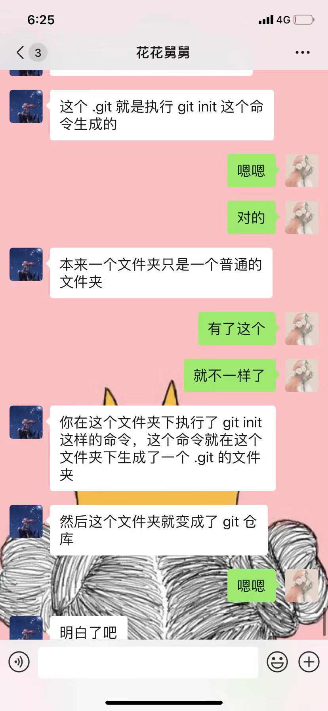
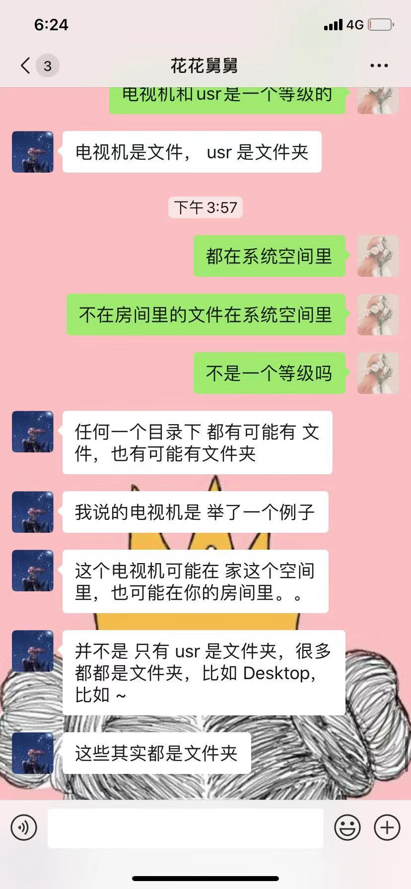
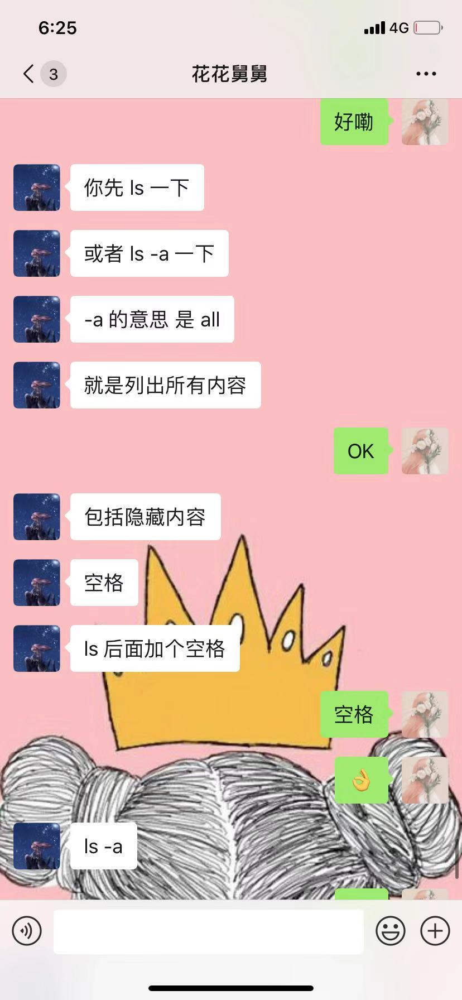
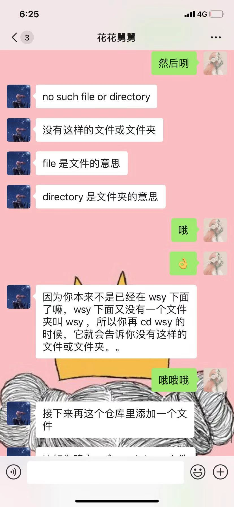

# 快乐学习
## 前言
- access不会用
-去学校要了邮箱 结果很low 还有简便操作没发现
-下载了翻墙软件
- 下载了谷歌 用电脑看YouTube 喜欢let me down slowly
- 手机连不了YouTube了我天
- 邮箱呢 密码呢
- OK了 手机好了 电脑又完了 密码超级复杂 不知道存哪合适
- 原来是电脑有点懵

## 第一天
- 下载好多软件
- 卡壳好久
- 好几次远程 远程太强了 以前真不知道这玩意。。
- 自学计算机。。。。佩服我自己 。。
   > 一级引用

- 欧克

 时间|人物|故事
 --- |---|-------
 时间|人物|故事
 时间|人物|故事

__我__
-----------------
 你
  你

- [ ] 不
- [ ] 要

[超强大的云开发平台coding](http://coding.net)

 分割线
  ----------------
 分割线

## 图片


 ```

 graph TD;

    A-->B;

    A-->C;

    B-->D;

    C-->D;

  ```
  ```
 sequenceDiagram

     participate Alice

     participate Bob

     Alice->>John:Holle john,how are you

     Loop healthcheck

          John->>John:Fight against hypochondria

     end

     Note right of John:Rational thoughts<br/>prevail

     John->>Alice:Great!

     John->>Bob:And you?

     Bob->>John:Jolly good!
 ```

## 第三天  git learning
### git简单指令
- pwd 就是告诉你你在哪：显示当前目录的全路径
- cd 嘿 就是进入的过程没有看哦
- ls list 列表 这时候要看了
- / 大空间 系统空间/根目录
- 文件夹 直属于系统空间/根目录
- 打cd 文件夹 进入文件夹 list列表内容 空格
- 插入图片 聊天记录。
- / 是系统根目录 ~用户根目录
- 进入Windows桌面用cd ~就欧克了
- 嗯。由于先打了cd ~ 已经进入了用户根目录，进入桌面要用cd Desktop
- Desktop也是文件夹，比较全


## 图片

 

 

 

 

 

 

 

 

 

 keai

 

 

 后缀名

keai


### git 入门知识
- git init 创建一个git仓库
- git status 检查一下 看加入没有
- git add 文件名字md
- git commit -m"名字” 提交文件 可以追踪
- git log 贴上标签 随时记录，有生产日期，生产商，改动情况，就是没有保质期哦
- mkdir wsy 创建一个叫wsy的文件夹 且在桌面上
- cd wsy就进去了该文件夹
- ls -a是列出所有内容的意思
- ./和../是两个快捷方式
- cd .进入文件  cd ..进入桌面
- 后缀名要改为md形式，用Atom打开
- 遇到了些问题 有空问一问
- cd 到桌面上 再输cd wsy 竟然说我没有
- 直接输cd wsy也不可。。
- 提交直接在Markdown下进行

## 第四天
- git add . 有点哦，可以把所有修改内容都添加
- git add 后面没有引号，勿要与commit搞混
- test在markdown下，可能就没有添加git的必要了
- ls -a列出所有哦，不要只写ls，可能会有隐藏部分
- 今天是要打算学习html+CSS+Javascript，但是搞GitHub半天
- github是个远程仓库
- 新建的仓库名称和文件夹名称要一样，不然无法同步
- 好好描述哦

##### 本地仓库同步git仓库

###### 新的命令

- git remote add：添加远程仓库such as：git remote add origin http：//github.com/WsYin/markdown.git

- git push -u origin master:把分支推送到远端
- 嗯嗯，不要在test下写命令，要在仓库的根目录下 执行指令哦
- 填写用户名和密码。。要死了。。密码是。。常用密码。。
- git账号名是gmail邮箱密码不是呵呵
- git remote add第一次添加以后就不用再输入了
- 后面呢，每次commit完之后就可以直接push了哈哈哈
- 大仓库下可以不用小仓库了，一个就够了，系统要报错。。

## 第五天
### 学习html 前端   （今日分享超链接，自行体会）
- [html教程 ] (https://www.runoob.com/html/html-tutorial.html)

- [简介](https://www.runoob.com/html/html-intro.html)

- [链接和图像](https://www.runoob.com/html/html-intro.html)

- [文本格式化](https://www.runoob.com/html/html-formatting.html)

- [列名单](https://www.runoob.com/html/html-lists.html)

- [打表格](https://www.runoob.com/html/html-tables.html)

- [最重要元素span和div](https://www.runoob.com/html/html-blocks.html)

- [CSS教程](https://www.runoob.com/html/html-summary.html)

- [Javascript教程](https://www.runoob.com/html/html-summary.html)

- [learning later](https://cn.vuejs.org/v2/guide/)

#### 几个注意事项
- 注意符号用英文
- 开始时要用英文状态下的叹号!回车出来内容
- 以后用谷歌的浏览器
- 只有在body中才会在浏览器显示
- 标签h、p、a、table、 input、del等等
- 浏览器会过滤空格
- 图片路径要正确啊，要在同一个文件夹里才行
- 看链接时记得看下标签啊
- 所有的标签都可以用div表示
- id 只能代表一个元素
- input 不是inpot

## 第八天
### Javascript learning

- 叹号一定是英文，然后要在标志为.html中打开，多一个少一个都不行，不能写错
- 输入<script>即可开始编写代码
- 在VSC中的代码查看运行需保存后，用coogle打开，右键检查，出现菜单栏，点击 console，并输入console.log(变量)
- 编写代码一定要规定变量名称var ...
- console.log就是在Google中输入检查的
- alert 会弹出对话框的哦
- // 语句 =注释
- 一定要定义一个变量
- 所有过程要用符号(变量符号)
- 页面出现的方式不只有小窗口，还有其它形式
- 需要将一个值附到html上
- undefined 没有定义
- 变量声明
- 独立思考的能力
- 数字和字符串 加减乘除+-* / %(取余)
- script的作用是辅助运行html
- 字符串拼接  '123' + '456' ='123456'(双单引号的注意)
- 代码的结构：顺序、循环、分支
- 分支(类似于判断)：如果怎样了就怎么样 有好几种选择
- 循环语言是在什么样的情况下，要反复执行什么样的语言
- if else
- for(   ){

}
- parselnt 字符串转换成汉字 字符串只有转成汉字了，才具备数字的意义
- createElement 创造一个元素
- querySelector 查找元素名
- appendChild 添加子元素
- 循环语句中(循环条件){循环体}
- 一定要把b系列的例子敲一遍哦

## 第好几天
### JS learning
- such as querySelector 是为了获得div的元素
- innerHTML 要给获得的元素进行赋值
- document是一个对象 代表你这个浏览器窗口可以显示的区域
- book=document 是对对象进行赋值
- document是一个通道，让book中的值通过，再由value获得并计算
- div区块元素 span是行内元素
- 区块就是一列一列俗称另起一行，然鹅，行内是一行一行俗称连起来
- 块级元素有哪些
- 行内元素有哪些
- 用CSS中的display属性去更改区块行内的性质
- n++是n+1的意思
- 变量和常量
### DOM树
- 一个html就是一个DOM树，分级的
- dom中有很多元素，div span h p 等等
- 查找元素：document.getElementsByTagName()当你的程序中只有div
没有分类元素时，可以用tag，先把所有元素获得，然后选择第一个（0），加上const定义常量，即可查找到所招元素，并成为元素更新增加的基础
- document.getElementsByClassName() class是分类名称，class=“ ” 查找时可以先获得所有class中的这个名称的元素，与上述过程一样
- 还可以直接在程序总直接写console.log就是在Google中输入检查的
- 更新，ele.innerText button 后有update
